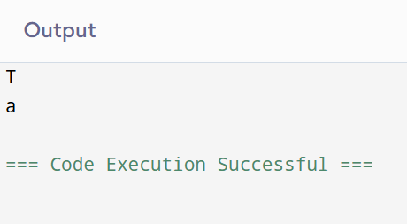

# Datatypes-Character Literal in Python

## 🎯 Aim
To write a Python program that prints the characters `'T'` and `'a'` using character literals.

## 🧠 Algorithm
1. Print the character `'T'`.
2. Print the character `'a'`.

## 🧾 Program
```
A='T'
B='a'
print(A)
print(B)
```

## Output


## Result
Thus, the program has been executed successfully.